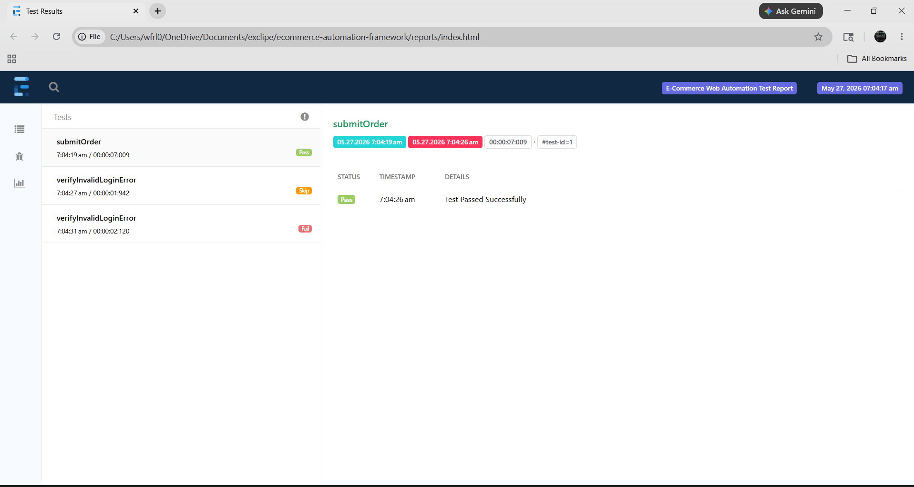
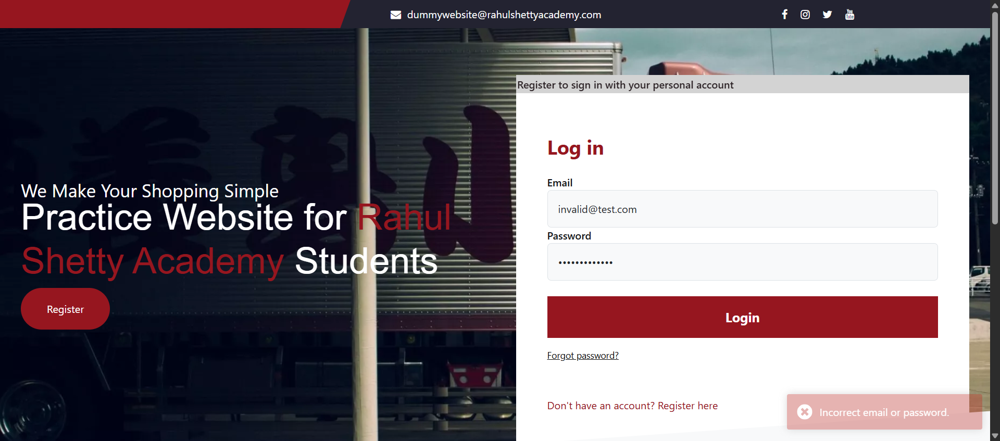

# E-Commerce Test Automation Framework

E-commerce UI Automation Framework demonstrating production-ready QA engineering practices. Built with Java/Selenium/TestNG, featuring Page Object Model architecture, dynamic data-driven testing, comprehensive Extent reporting, and automated CI/CD workflows.

[](https://openjdk.org/)
[](https://www.selenium.dev/)
[](https://testng.org/)
[](https://maven.apache.org/)
[](https://logging.apache.org/log4j/2.x/)
[](https://github.com/features/actions)

---

## 🏗️ Architecture & Key Features

*   **Thread-Safe Execution:** Implements `ThreadLocal<WebDriver>` within a dedicated `DriverManager` to prevent race conditions during parallel test runs.
*   **Composition Over Inheritance:** Avoids common anti-patterns (like page objects inheriting from wait classes). Uses a modular `BasePage` structure composed of standalone utilities (`WaitUtils`).
*   **Data-Driven Design:** Decouples test data completely from execution logic using dynamic, file-based TestNG DataProviders reading from:
    *   **JSON** (using Jackson Databind)
    *   **Excel** (using Apache POI)
*   **Robust Explicit Waits:** Standardized on `WebDriverWait` for dynamic elements at page transition points. Implicit wait is eliminated to avoid stacking latency and flaky runs.
*   **Logging & Tracing:** Outfitted with `Log4j2` for fine-grained trace logs printed to both the terminal and execution files (`logs/app.log`).
*   **Automatic Failure Screenshots:** Integrated with a custom TestNG Listener to capture page screenshots automatically on failure, attaching them directly to the Extent Report.
*   **Continuous Integration:** Programmed with a ready-to-run GitHub Actions workflow pipeline to run test suites in headless Chrome on pull requests or commits.

---

## 🧪 Test Scenarios Covered
- **End-to-End Checkout:** Complete flow from adding items to cart, logging in, and placing an order.
- **Error Validation:** Verification of dynamic error messages during invalid login attempts.
- **Data-Driven Execution:** Both scenarios run against multiple datasets injected dynamically via JSON and Excel files.
---

## 📂 Project Directory Structure

```text
ecommerce-automation-framework/
├── .github/
│   └── workflows/
│       └── test-execution.yml          # GitHub Actions CI/CD workflow
├── docs/
│   └── screenshots/                    # Documentation screenshots for README
│       ├── extent-report.png           # (Place your Extent Report screenshot here)
│       └── test-execution.png          # (Place your Test Execution Console screenshot here)
├── src/
│   ├── main/java/com/ecom/
│   │   ├── config/
│   │   │   └── ConfigReader.java       # High-performance static configuration loader
│   │   ├── driver/
│   │   │   └── DriverManager.java      # ThreadLocal driver instantiator (Chrome/Firefox/Edge)
│   │   ├── pages/
│   │   │   ├── BasePage.java           # Base Page Object with WaitUtils composition
│   │   │   ├── LoginPage.java
│   │   │   ├── ProductsPage.java
│   │   │   ├── CartPage.java
│   │   │   ├── CheckoutPage.java
│   │   │   ├── ConfirmationPage.java
│   │   │   └── RegisterPage.java
│   │   ├── reports/
│   │   │   └── ExtentReportManager.java # Thread-safe Singleton Extent Report generator
│   │   └── utils/
│   │       ├── ExcelUtils.java          # Apache POI Excel parsing utility
│   │       ├── JsonUtils.java           # Jackson Databind JSON map reader
│   │       ├── ScreenshotUtils.java     # Selenium failure screenshot taker
│   │       └── WaitUtils.java           # Standalone explicit wait helper
│   └── test/java/com/ecom/
│       ├── base/
│       │   └── BaseTest.java            # WebDriver lifecycle controller
│       ├── dataprovider/
│       │   └── TestDataProvider.java    # Consolidated file-based data provider
│       ├── listeners/
│       │   ├── RetryAnalyzer.java       # Automatic flakiness retry analyzer
│       │   └── TestListener.java        # Thread-safe reporting listener
│       └── tests/
│           ├── OrderPlacementTest.java  # Comprehensive E2E test suite (Smoke/Regression)
│           └── ErrorValidationTest.java # Validation test suite (Regression)
├── src/test/resources/
│   ├── config/
│   │   └── config.properties            # System-wide execution parameters
│   ├── log4j2.xml                       # Log4j2 layout and logging levels configuration
│   ├── testdata/
│   │   ├── TestData.json                # JSON test data
│   │   └── OrderData.xlsx               # Excel test data
│   ├── testng-suite.xml                 # Parallel E2E suite file
│   └── testng-groups.xml                # Filtered groups execution suite
├── .gitignore                           # Excluded build directories, logs and reports
├── pom.xml                              # Maven build configuration
└── README.md                            # Professional documentation
```

---

## 🛠️ Setup and Installation

### Prerequisites
- **Java JDK 17** installed and configured in your environment path.
- **Apache Maven 3.x** installed.
- **Google Chrome** (or Firefox / Edge) installed.

### Clone the Repository
```bash
git clone https://github.com/krishnaveni0411/selenium-java-testng-ecommerce-automation-framework.git
cd selenium-java-testng-ecommerce-automation-framework
```

---

## 🚀 Running Tests Locally

All parameters (browser, url, test suite XML) can be overridden directly from the command line.

### Run Default Regression Suite (Parallel Execution)
```bash
mvn clean test
```

### Run on a Different Browser
```bash
mvn clean test -Dbrowser=firefox
```

### Run by Specific TestNG Group (e.g., Smoke)
```bash
mvn clean test -DsuiteXmlFile=src/test/resources/testng-groups.xml
```

---

## 📊 Logging & Reporting

### Console & File Tracing
Framework logs are saved to `logs/app.log` and also streamed directly to standard output:
```text
2026-05-25 15:58:10 [main] INFO  com.ecom.base.BaseTest - Initializing WebDriver instance for browser: chrome
2026-05-25 15:58:12 [main] INFO  com.ecom.base.BaseTest - Launching application URL: https://rahulshettyacademy.com/client/
2026-05-25 15:58:14 [main] INFO  com.ecom.tests.OrderPlacementTest - Adding product to cart: ADIDAS ORIGINAL
```

### HTML Test Reports
Execution reports with embedded screenshots on failure are generated at the end of each run:
- **Location:** `reports/index.html`



### Automatic Failure Screenshot Capture
When a test fails, the framework automatically captures a screenshot of the browser state at that exact moment. Here is an example captured during a recent test run:



---

## 🚀 CI/CD Integration (GitHub Actions)
The project includes a fully integrated workflow config `.github/workflows/test-execution.yml` that triggers on every push/PR to main.
1. Checks out the code.
2. Installs headless Chrome.
3. Sets up JDK 17.
4. Executes the Maven regression suite.
5. Archives and uploads the **Extent Report** and **Log4j2 Logs** to the workflow summary.

---

## 👤 Author
**Krishnaveni K**
- 💼 [LinkedIn Profile](https://www.linkedin.com/in/krishnaveni-k04/)
- 📧 Email: krishna20009697@gmail.com
